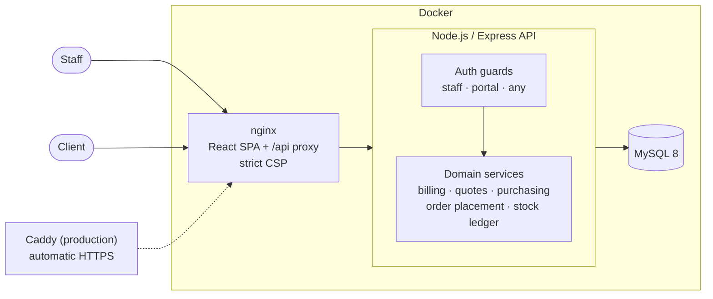

# B2B Management Platform

[](https://github.com/bijigunerachid/b2b-management-platform/actions/workflows/ci.yml)


An end-to-end platform for a wholesale business: **quotes → orders → invoices → payments**, a **stock ledger with purchasing**, and a **self-service portal** where clients order and accept quotes themselves.


## Highlights

- **The whole sales cycle.** Quotes with negotiated prices convert into orders at the quoted price, orders produce A4 invoices with 20% VAT, and payments drive paid / partially paid / overdue status and a receivables ageing report.
- **Inventory you can audit.** Every stock change is a ledger entry (sale, cancellation, purchase receipt, adjustment with a reason), and the ledger always sums to current stock. Reorder points come from real sales; suggestions turn into purchase orders in one click.
- **A real client portal.** Customers sign in to browse the catalog, place orders, download invoices, and accept quotes online, fully isolated from internal data.
- **Built to be trusted.** Session revocation, rate-limited login, CSRF protection, strict CSP, role-based access checked on every request, and row locks wherever two people could race.
- **Tested and shippable.** 132 Jest tests run in CI with a dependency audit, lint, and production build; one command starts the Docker stack, and another adds automatic HTTPS.

## Tour

<table>
  <tr>
    <td width="50%"><br><sub><b>Quotes:</b> negotiated prices, discount vs list price, one-click conversion to an order.</sub></td>
    <td width="50%"><br><sub><b>Orders &amp; payments:</b> partial payments, balance due, and guarded status changes.</sub></td>
  </tr>
  <tr>
    <td><br><sub><b>Invoices:</b> A4 print/PDF with VAT, payment stamp, and payments received.</sub></td>
    <td><br><sub><b>Receivables:</b> ageing buckets, top debtors, and open invoices.</sub></td>
  </tr>
  <tr>
    <td><br><sub><b>Reordering:</b> demand-based reorder points grouped by supplier.</sub></td>
    <td><br><sub><b>Purchasing:</b> overdue tracking; receiving adds stock through the ledger.</sub></td>
  </tr>
  <tr>
    <td><br><sub><b>Client portal:</b> balances, overdue alerts, and order tracking for customers.</sub></td>
    <td><br><sub><b>Self-service ordering:</b> catalog, cart, and checkout with VAT.</sub></td>
  </tr>
  <tr>
    <td><br><sub><b>Command palette:</b> <kbd>Ctrl</kbd>+<kbd>K</kbd> to jump anywhere or search records.</sub></td>
    <td><br><sub><b>Dark mode:</b> follows the OS, with a toggle.</sub></td>
  </tr>
</table>

## Architecture



- **One origin.** nginx serves the app and proxies `/api`, so the session cookie stays first-party (`SameSite=Strict`) with no CORS to configure. Only nginx is exposed; the API and database stay on a private network.
- **Domain logic in pure modules.** Billing, quote lifecycle, and purchasing rules have no database access, so the money math and state machines are unit tested directly.
- **Shared services for anything that changes stock.** Order placement and the stock ledger are single code paths, used by staff orders, quote conversion, portal checkout, and purchase receipts alike.

## Engineering decisions

| Problem | Decision |
| --- | --- |
| Stock numbers drift and nobody knows why | Stock only changes through `recordMovement()`, which writes a ledger row with the resulting balance, so `SUM(movements) = stock` holds by construction. The demo seed rebuilds histories that preserve it. |
| Two people convert the same quote, or receive the same delivery | Transactions with `SELECT … FOR UPDATE`, so a second concurrent request sees the new state and is refused. Products are always locked in id order to avoid deadlocks. |
| Rounding errors in totals | Prices are summed in integer cents; VAT is applied once per invoice and rounded the same way on the server and the printed invoice. |
| "Overdue" and "Expired" get out of sync | Derived from dates on every read, never stored. |
| A stolen cookie stays valid after logout | Each user has a `token_version`; logout, password and role changes, and deactivation bump it, ending all sessions at once. |
| Client accounts reaching internal data | `protect` is staff-only by default, so every internal route refuses portal accounts without per-route changes. Portal queries are scoped to the session's company, never to request input. |
| Node and MySQL disagreeing about time | UTC end to end: the driver and every MySQL session use UTC, and calendar dates are plain `YYYY-MM-DD` strings. |
| Slow first load | Route-level code splitting: each page, including the whole client portal, is its own chunk, so the main bundle is 307 KB. |

## Features

**Sales**
- **Quotes (devis):** draft → sent → accepted/rejected → converted, with automatic expiry, discounts against list price, a printable quote with an acceptance block, and win-rate KPIs.
- **Orders:** an order builder with stock checks, a status timeline, and payment and date filters.
- **Invoices:** printable A4 documents with 20% VAT and a payment stamp.
- **Payments:** full or partial; mistakes are voided with an audit trail, never deleted.
- **Receivables:** ageing buckets (current, 1–30, 31–60, 61–90, 90+), top debtors, and CSV export.
- **Customers:** profiles with order history, lifetime value, outstanding balance, and portal access management.

**Catalog & inventory**
- **Products:** server-side search, filters and sorting, per-product reorder points, a preferred supplier, and stock history.
- **Stock ledger:** every movement filterable by type, with reasons required for adjustments.
- **Purchasing:** suppliers with lead times, purchase orders (draft → ordered → received), overdue deliveries, and reorder suggestions that become draft purchase orders.

**Client portal**
- **Shopping:** catalog with availability (never exact stock), a cart, and checkout.
- **Self-service:** order tracking, reordering in one click, invoice downloads, quote acceptance, and password changes.

**Platform**
- **Dashboard:** revenue and order charts, status breakdown, top products, and alerts.
- **Productivity:** a `Ctrl`/`⌘`+`K` command palette, notifications, and dark mode.
- **Interface:** responsive layout with animated modals, drawers, and toasts.
- **Roles:** Admin, Manager, Employee, and Customer, each enforced by the API and reflected in the UI.

## Tech stack

| Layer | Technologies |
| --- | --- |
| Frontend | React 19 (with React Compiler), React Router 7, Vite, Tailwind CSS 4 |
| Backend | Node.js 22, Express 5, mysql2, JWT, bcrypt, Helmet, express-rate-limit |
| Database | MySQL 8 with idempotent SQL migrations |
| Quality | Jest + Supertest, ESLint, GitHub Actions |
| Delivery | Docker Compose, nginx, Caddy (automatic HTTPS) |

## Getting started

### Prerequisites

* Node.js 22 and npm
* MySQL 8
* Git

### 1. Clone the repository

```bash
git clone https://github.com/bijigunerachid/b2b-management-platform.git
cd b2b-management-platform
```

### 2. Create the database

```bash
mysql -u root -p < database/schema.sql
```

This creates the `b2b_management` database, all tables, and the Admin, Manager, Employee, and Customer roles.

### 3. Configure and start the backend

```bash
cd backend
npm install
cp .env.example .env
```

Edit `backend/.env`: set `DB_PASSWORD`, and replace `JWT_SECRET` with a random value:

```bash
node -e "console.log(require('crypto').randomBytes(48).toString('hex'))"
```

Apply database migrations, then start the API on `http://localhost:5000`:

```bash
npm run migrate
npm run dev
```

### 4. Create the first admin account

In `backend/.env`, temporarily uncomment `ADMIN_EMAIL` and `ADMIN_PASSWORD` (at least 12 characters), then run:

```bash
npm run create-admin
```

Remove both lines from `.env` afterwards. The server prints a warning while `ADMIN_PASSWORD` is still set.

### 5. Configure and start the frontend

In another terminal:

```bash
cd frontend
npm install
cp .env.example .env.local
npm run dev
```

Open `http://localhost:5173` and sign in with your admin account. `VITE_API_URL` in `.env.local` points the frontend at the backend; the default matches step 3.

### Optional: load demo data

```bash
cd backend
npm run seed:large
```

This builds a realistic business:
- **Volume:** 400 customers, 350 products, and 5,000 orders over 18 months.
- **Payments:** older invoices are mostly paid, recent ones are often open, and a few are overdue.
- **Quotes:** a pipeline whose converted quotes are derived from real orders.
- **Purchasing:** suppliers, reorder points based on real sales, and purchase-order history.
- **Accounts:** 24 team members and 3 client portal logins (`buyer@<company>.portal.example`).

The seeded accounts share one password, which is printed once. Set `SEED_USER_PASSWORD` in `.env` to choose it.

| Command | Purpose |
| --- | --- |
| `npm run seed:large -- --orders=20000 --customers=1000` | Custom volumes (appends in one transaction) |
| `npm run seed:large -- --reset` | Delete **all** business data first (real user accounts are kept) |
| `npm run seed:payments` / `seed:quotes` / `seed:purchasing` / `seed:portal` | Add one area to an existing database; each is safe to re-run |

## Deployment (Docker)

```text
browser ──► nginx (frontend)  ── /        → built React app
                              └─ /api/*   → backend (Node.js) ──► MySQL 8
```

### Run locally

```bash
cp .env.example .env        # fill in the three secrets
docker compose up -d --build
```

Open `http://localhost:8080`. On first start, MySQL loads `database/schema.sql` and the backend applies migrations before it starts.

Create the first admin and, optionally, demo data:

```bash
docker compose exec -e ADMIN_EMAIL=you@example.com -e ADMIN_PASSWORD='a-strong-password-1' backend npm run create-admin
docker compose exec backend npm run seed:large
```

### Deploy to a server with HTTPS

On any Linux VPS with Docker installed and a DNS record pointing your domain at it:

```bash
git clone https://github.com/bijigunerachid/b2b-management-platform.git
cd b2b-management-platform
cp .env.example .env        # set secrets, DOMAIN, and PUBLIC_URL=https://<DOMAIN>
docker compose -f docker-compose.yml -f docker-compose.prod.yml up -d --build
```

[Caddy](https://caddyserver.com) obtains and renews the TLS certificate automatically. Health is exposed at `/api/health` for uptime monitors.

### What the containers enforce

* The backend runs as a non-root user, applies idempotent migrations on start, and only becomes healthy once the database answers.
* The API connects with a dedicated MySQL account, never root; the database has no published port.
* nginx serves hashed assets with long-term caching and never caches `index.html`. It also sends a strict Content-Security-Policy (no inline scripts), `X-Frame-Options: DENY`, and related headers.
* Compose refuses to start when a required secret is missing.

## Testing

```bash
cd backend && npm test          # 132 Jest tests: API security, billing, quotes, purchasing, order placement, seeding
cd frontend && npm run lint     # ESLint, including React hooks rules
```

GitHub Actions runs on every push and pull request:
- the backend tests
- a dependency audit
- the frontend lint
- the production build

## API overview

| Area | Endpoints |
| --- | --- |
| Auth | `/api/auth` (login, logout, me, password) |
| Sales | `/api/customers`, `/api/orders`, `/api/quotes`, `/api/payments`, `/api/receivables` |
| Catalog | `/api/products`, `/api/categories` |
| Inventory | `/api/inventory`, `/api/purchase-orders`, `/api/suppliers` |
| Administration | `/api/users`, `/api/portal-users`, `/api/dashboard` |
| Client portal | `/api/portal` (summary, catalog, orders, quotes) |
| Operations | `/api/health` |

## Security

* **Passwords:** bcrypt (cost 12); minimum 10 characters with a letter and a number, maximum 72 bytes.
* **Sessions:** HS256 JWT in an `HttpOnly`, `SameSite=Strict` cookie (`Secure` in production), with a 1-hour lifetime.
* **Revocation:** each user has a `token_version`. Logout, password change, role change, and deactivation bump it, ending every existing session instantly.
* **Login protection:** rate limited per account (5 failures per 15 minutes) and per IP (30 per 15 minutes). Responses take the same time either way, so they never reveal whether an email exists.
* **CSRF:** state-changing requests must come from an allowed `Origin`/`Referer`, on top of `SameSite=Strict`.
* **Headers:** Helmet with a locked-down CSP, `nosniff`, and frame protection. `X-Powered-By` is removed, and API responses are `Cache-Control: no-store`.
* **Input:** every write route validates types, lengths, and ranges. Bodies are limited to 100 KB, all SQL is parameterized, and sort columns are whitelisted.
* **Authorization:** roles are read from the database on every request, never trusted from the token. Staff routes refuse portal accounts by default, and the last active admin can't be demoted or deactivated.
* **Secrets:** environment variables keep credentials out of source code, and the server refuses to start with a short `JWT_SECRET`.

| Variable | Purpose |
| --- | --- |
| `NODE_ENV=production` | Enables `Secure` cookies and stricter startup checks |
| `CORS_ORIGIN` | Comma-separated frontend origins (required in production, `https://` only) |
| `TRUST_PROXY` | Set (e.g. `1`) behind a reverse proxy so rate limits see real client IPs |

## Project structure

```text
b2b-management-platform/
├── .github/workflows/        # CI: tests, audit, lint, build
├── deploy/Caddyfile          # HTTPS reverse proxy for production
├── docker-compose.yml        # MySQL + API + nginx
├── docker-compose.prod.yml   # adds Caddy with automatic HTTPS
├── docs/screenshots/         # images used in this README
├── backend/src/
│   ├── __tests__/            # Jest + Supertest suites
│   ├── billing/              # VAT, balances, ageing (pure)
│   ├── quotes/               # quote lifecycle rules (pure)
│   ├── purchasing/           # PO lifecycle, reorder suggestions (pure)
│   ├── services/             # order placement, stock ledger, transactions
│   ├── controllers/  routes/  middleware/  validation/
│   ├── seed/  scripts/       # demo data, migrations, admin bootstrap
│   └── server.js
├── database/
│   ├── schema.sql            # full schema for new installs
│   └── migrations/           # idempotent incremental changes
└── frontend/src/
    ├── components/           # app shell, UI kit, printable documents
    ├── pages/                # back-office screens
    ├── portal/               # client portal (layout, cart, pages)
    └── lib/                  # API client, formatting, display rules
```

## Roadmap

- Customer-specific pricing and volume discounts
- Returns (RMA) that restock items and issue credit notes
- French / Arabic interface with right-to-left support
- Browser end-to-end tests (Playwright) in CI

## Author

**Rachid Bijigune**: Full-Stack Development | Big Data

GitHub: [@bijigunerachid](https://github.com/bijigunerachid)
